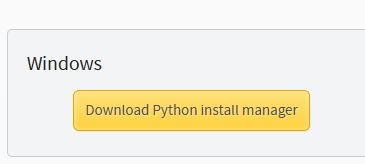
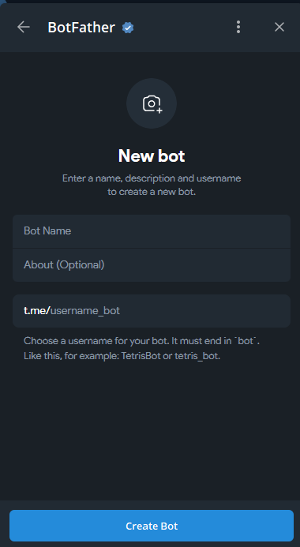
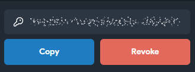
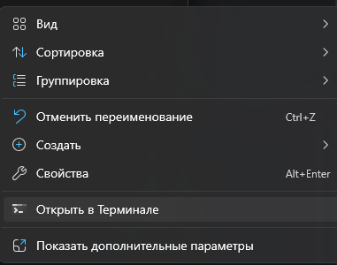

# 📘 РУКОВОДСТВО ПО РУЧНОМУ ЗАПУСКУ БОТА (bot.py)

---
## 📁 1. СКАЧИВАНИЕ Python

1. **Проверьте**, вдруг python уже установлен у вас на пк. Для этого откройте коммандную строку и введите 
```bash
   python --version
```
   Если у вас отобразилась версия python, значит он у вас уже есть, переходите к следующему пункту.
2. **Если python не установлен** - перейдите по ссылке https://www.python.org/downloads/ и загрузите версию python 3.14.

---

## 🏗️ 2. ПОДГРУЗКА БИБЛИОТЕК

Бот использует библиотеку PyTelegramApi, поэтому установте её:

```bash
pip install pyTelegramBotAPI
# или
pip3 install pyTelegramBotAPI
```

---

## 🔔 3. ЗАМЕНА ТОКЕНА НА ВАШ И ПОДГОТОВКА БД

Без токена бот работать не будет.

Создайте в боте BotFather нового бота и скопируйте его токен.
В файл token.txt скопируйте ваш токен. Важно чтобы не было лишних символов, только токен






Далее см файл GUIDE_BD.md, там описано как изменять базу данных и добавить свои данные.
---

## 🔔 4. ЗАПУСК БОТА

Запуск бота осуществляется через консоль.

1. Откройте папку из архива
2. Нажмите правой кнопкой мыши и выберите 'открыть в терминале'\

3. Введите в терминале комманду
```bash
python -m bot.py
# или
python3 -m bot.py
```

## В СЛУЧАЕ ОШИБОК ПИШИТЕ, СО ВСЕМ ПОМОГУ И ОТВЕЧУ НА ВОПРОСЫ. TG: @mnbvvvxc